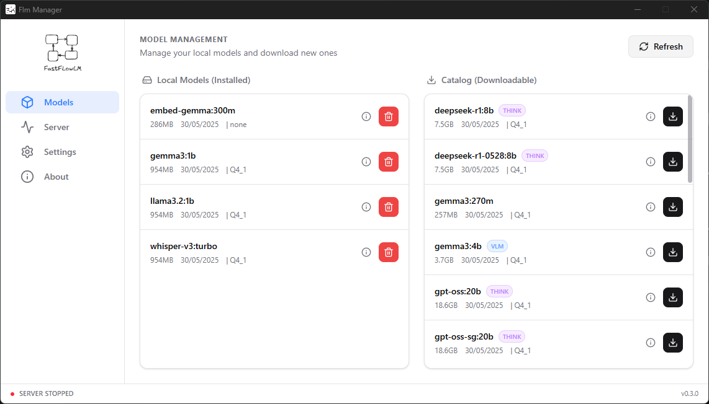
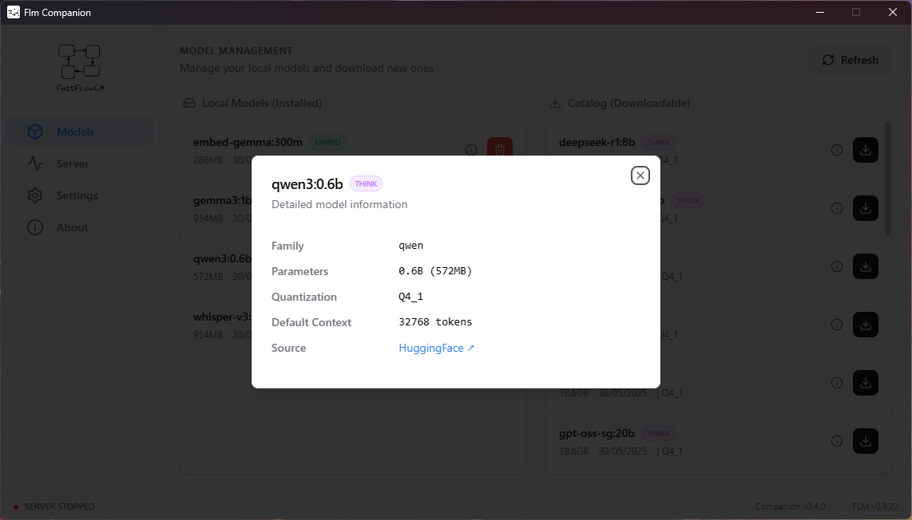
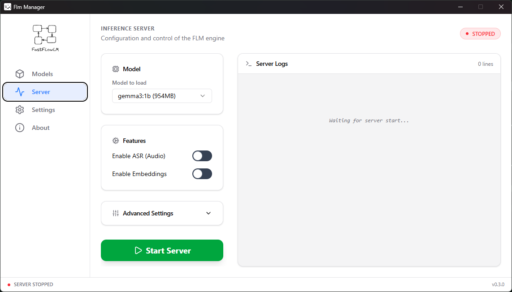
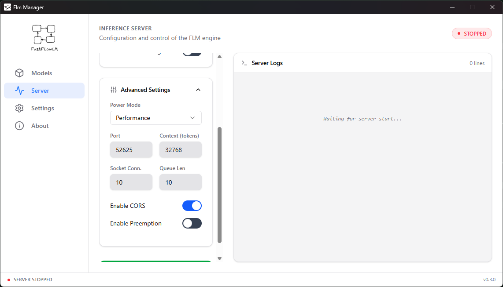
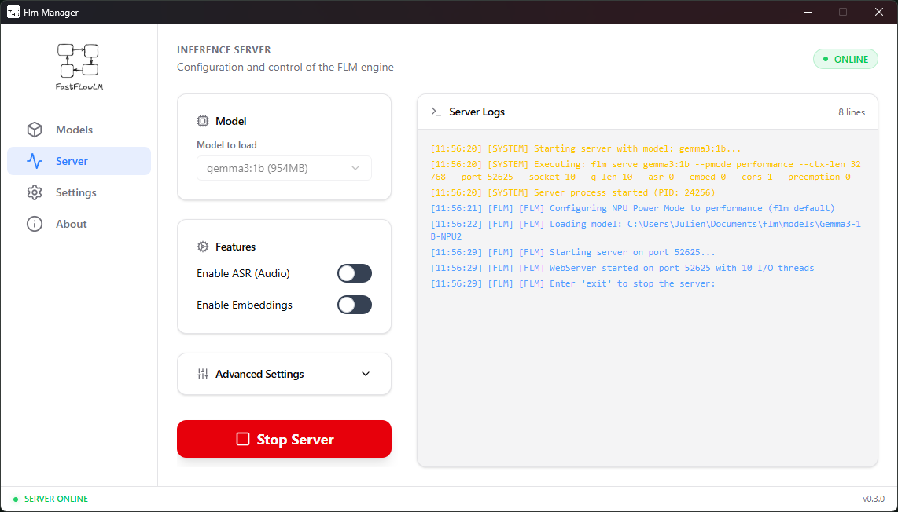
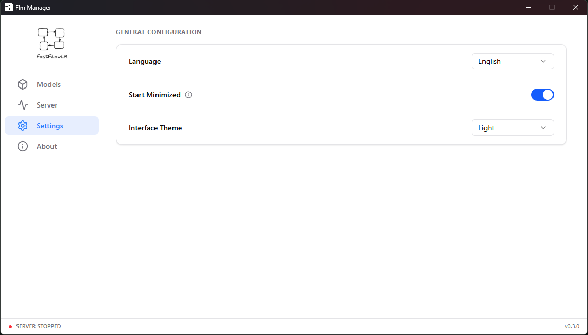
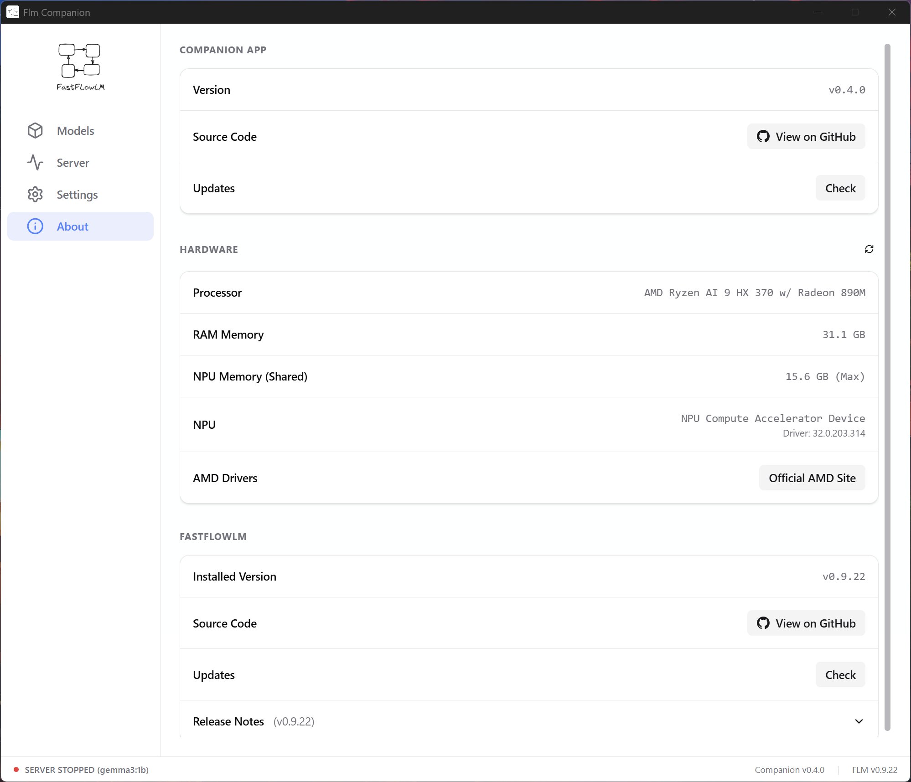
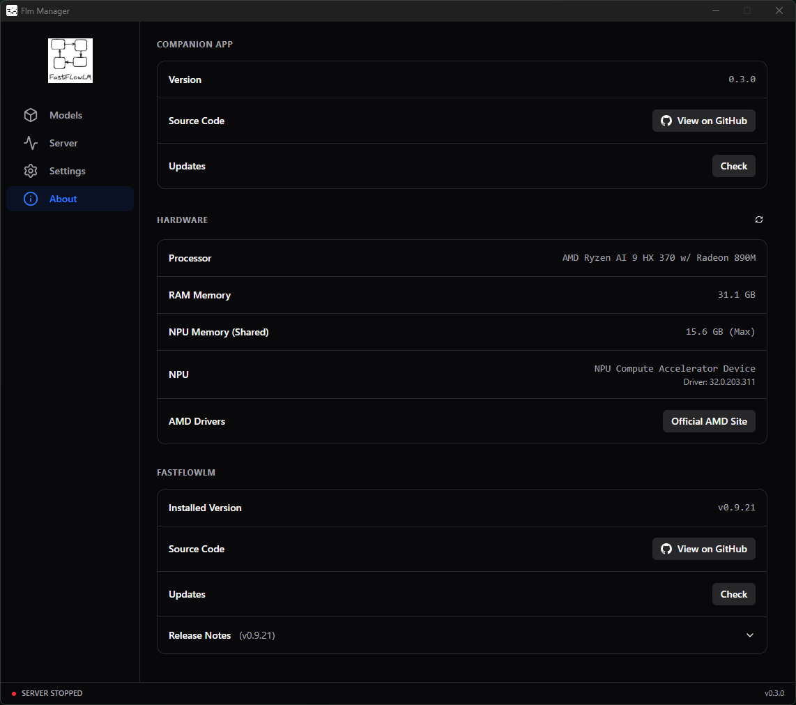

<div align="center">

<h1 style="border: none;">🤖 Flm Compagnon</h1>

[](https://github.com/FastFlowLM/FastFlowLM)

[](https://github.com/julienM77/flm-companion/releases)
[](https://github.com/julienM77/flm-companion/actions/workflows/main.yml)
[](LICENSE)

[](https://github.com/julienM77/flm-companion/releases)
[](https://tauri.app)

</div>

## 📝 Description

Flm Compagnon is a modern GUI designed to accompany and manage the **FastFlowLM (FLM)** project. It offers a smooth user experience to interact with your local AI models, monitor the server, and manage your configurations.

> [!IMPORTANT]
> This application requires **[FastFlowLM (FLM)](https://github.com/FastFlowLM/FastFlowLM)** to be installed on your system. Without it, Flm Compagnon will not function.

## ✨ Features

* **Models**: Model manager (download, delete, inspect details).
* **Server**: Configuration and management of the FLM server instance.
* **System Tray**: Quick access to server controls and status from the notification area.
* **Start Minimized**: Option to launch the application minimized to the system tray (configurable in settings).
* **Settings**: Application customization.
* **About**: View application version, hardware information, and check for updates.
* **Multilingual**: Interface management in English and French.
* **Theme**: Management of light and dark themes.

## 📸 Screens

### 🗂️ Models Management

| Models List | Model Information |
|:---:|:---:|
| [](screen/gestion_models.png) | [](screen/gestion_models_informations.png) |
| *Browse and manage your local AI models* | *View detailed model information (family, size, quantization)* |

### ⚙️ Server Management

| Server Configuration | Custom Parameters | Server Running |
|:---:|:---:|:---:|
| [](screen/serveur.png) | [](screen/serveur_customparameters.png) | [](screen/serveur_started_log.png) |
| *Select model and configure server options* | *Advanced settings (port, context, CORS...)* | *Real-time server logs and status* |

### 🎨 Settings & About

| Settings | About (Light) | About (Dark) |
|:---:|:---:|:---:|
| [](screen/settings.png) | [](screen/about.png) | [](screen/about_dark.png) |
| *Language, theme and application preferences* | *Hardware info and update checker* | *Dark theme support* |

### 🔔 System Tray

| Notification Menu |
|:---:|
| [](screen/notification.png) |
| *Quick access to server controls from system tray* |

## 📋 To do

* [X] Clean code and optimisation
* [ ] Fix the server management design for consistency
* [X] Add a version check for the companion application (+ changelog)
* [X] Add caching for the list of models, CPU version, and RAM
* [X] Force an update of the model list on the server configuration side when models are modified (DLL, delete)
* [ ] Add menus to the notification area icon (server management, models)
* [X] Complete the translation of all texts for multilingual support
* [X] Flm update 0.9.21 → add the option to launch the server without a model using ASR for Whisper

## 🤝 Contribution

This project is open-source and open to contributions! Feel free to propose improvements via **Pull Requests** or report issues.

## 🚀 Installation and Development

To run the project in development mode, you will need [Rust](https://www.rust-lang.org/) and [Node.js](https://nodejs.org/).

1. Install JavaScript dependencies:

    ```bash
    npm install
    ```

2. Run the application in development mode:

    ```bash
    npm run tauri dev
    ```

To build the project in release mode, you will need [Rust](https://www.rust-lang.org/) and [Node.js](https://nodejs.org/).

1. Install JavaScript dependencies:

    ```bash
    npm install
    ```

2. Build the application in release mode:

    ```bash
    npm run tauri build
    ```
